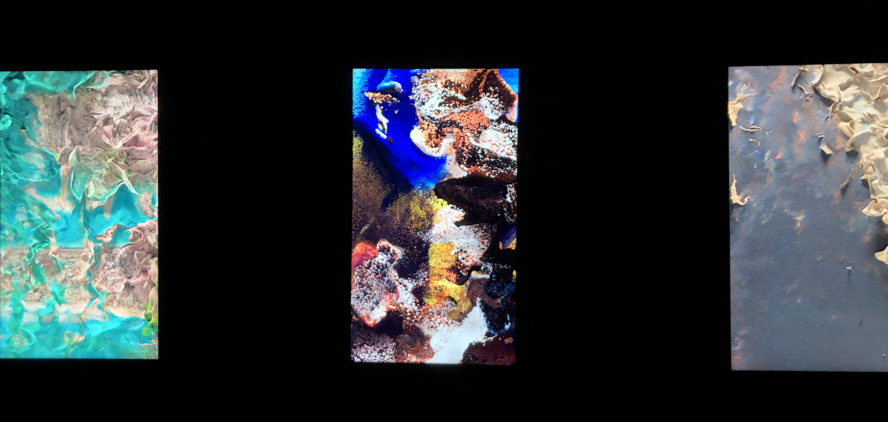

# Space Dreams, Urban Dreams, Nature Dreams

>## *REFIK ANADOL, 2020* 

### 5th International Digital Art Biennial, Arsenal Contemporary Art Montreal *11/19/2021 - 01/02/2022*

#### DATE DE LA VISITE : 10/02/2022

## DESCRIPTION 
>#### Ces textes sont tirés du site web de l'exposition International Digital Art Biennial - [Exposition BIAN site web](https://www.elektramontreal.ca/bian2021-refik-anadol?lang=fr)

### _Space Dreams_ 
Transforme un vaste ensemble de données de 1,2 million d'images capturées à partir de la station spatiale internationale (ISS), ainsi que des images satellites supplémentaires des topologies de la Terre, en un tableau de données dynamiques. Chaque version du rêve de la machine est dérivée d'une marche latente différente du réseau antagoniste génératif (GAN), explorant la capacité de l'intelligence artificielle à atteindre son propre subconscient et offrant une forme d'esthétique cartographique d'avant-garde.
  
### _Urban Dreams_ 
Anadol offre de nouvelles perspectives sur les possibilités de représentation qui émergent à l'intersection de la technologie avancée, de la mémoire urbaine et l'art contemporain. L'œuvre utilise plus de 100 millions d'images provenant des villes de New York et Berlin, en se concentrant plus particulièrement sur les espaces publics typiques. Le contenu est utilisé pour former un StyleGAN2 à l'identification et à l'apprentissage des motifs cachés dans le paysage urbain, en montrant comment le processus insaisissable de récupération de la mémoire se transforme en données les collections. 
  
### _Nature Dreams_
Une série d'expériences de réalité synesthésique basée sur le style GAN 2 utilisant plus de 69 millions d'images des parcs nationaux, de l'Islande et d'autres merveilles naturelles pour former un modèle générateur de la machine pour rêver des éléments les plus fascinants de notre Mère Nature. Cette transformation des données devient non seulement un moyen de visualiser l'information, mais aussi une transmutation de notre désir de faire l'expérience de la nature en un visuel poétique.

## EXPLICATION SUR LA MISE EN ESPACE DE L'OEUVRE
- L'oeuvre est esxposé dans une pièce sombre avec d'autres oeuvres à l'entour. Placé sur un grand mur noir, la création est étallée sur un bon 5 mètres environ de mémoire
-  

## Liste des composantes et techniques de l'oeuvre ou du dispositif (ex. : réalité virtuelle, projecteurs, caméra USB, anneau lumineux...)
- Écran

## Liste des éléments nécessaires pour la mise en exposition  
- Du tape noir pour camoufler les fils
- Une pièce sombre pour avoir une meilleure expérience 

## EXPÉRIENCE VÉCUE:

- DESCRIPTION DE VOTRE EXPÉRIENCE DE L'OEUVRE: 
  - Il y a énormément (on parle de plus d'un million) de minuscules micros-images qui se déplacent en même temps qui créent une sorte de mouvement très fluide, voir presque hypnotisant
  - Un mouvement avec de la profondeur créée avec des images 2D est assez impressionnant à voir, nous avions le goût d'aller nager dans l'oeuvre
  
  
    
 

- ASPECT QUE VOUS NE SOUHAITERIEZ PAS RETENIR POUR VOS PROPRES CRÉATIONS: 
  - J'aurais évitée de placer d'autres oeuvres similaires aussi proches  
  - J'aurais placée le cartel plus proche de l'oeuvre et fait attention à ce qu'on distingue bien quel nom appartient à laquel de ces oeuvres qui forme une création

