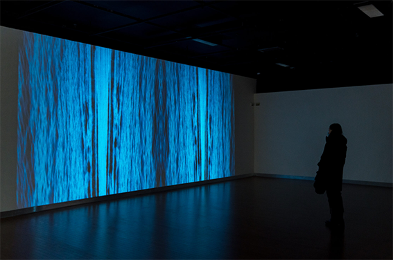
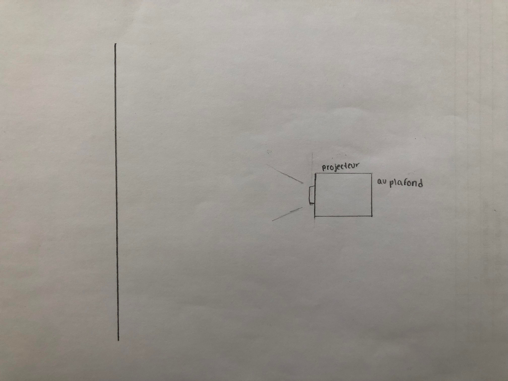
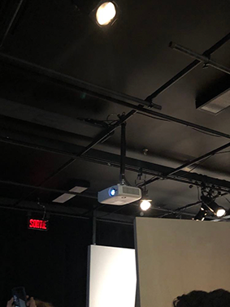
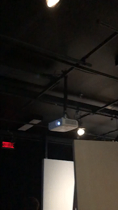
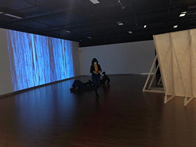

# Le fleuve, 50˚11'53,8"N.,66˚4'10"O.

>## *Catherine Béchard et Sabin Hudon, 2021* 

### Configurations du sensible | Maison des Arts, Laval, salle Alfred-Pellan *02/20/2022 - 04/16/2022*

#### DATE DE LA VISITE : 17/03/2022

## À PROPOS DE L'EXPOSITION CONFIGURATION DU SENSIBLE - les sens et émotions
>#### Ces textes sont tirés du site web de l'exposition de la Maison des Arts de Laval - [Configurations du sensible site web](https://www.laval.ca/Pages/Fr/Calendrier/mda-expo-bechard-hudon.aspx)

Depuis plus de 20 ans, le duo Béchard Hudon sonde la charge tant physique que sociale des résonances acoustiques à travers des œuvres installatives sonores et sculpturales qui appellent l'écoute attentive et l'observation dans la durée. L'exposition Configurations du sensible présente leurs plus récentes productions, entre autres la série Mécanismes de dessaisissement (2019-2020), composée de 3 sculptures murales géométriques et cinétiques au fort potentiel vibratoire, et L'en deçà (2021), une imposante structure en bois aux consonances architecturales interagissant avec le public à travers de profondes modulations sonores. Si cette dernière pièce met de l'avant le paysage acoustique et tellurique de différents milieux naturels où le duo a mené des recherches de fond, d'autres œuvres misent sur des variations optiques qui témoignent implicitement d'une volonté de bousculer certains paradigmes sociaux afin de repenser nos manières de voir et d'agir. Dans l'ensemble, l'exposition convie à une réflexion sur « l'épaisseur du présent », entendu par la philosophe Isabelle Stengers comme l'expérience d'un temps non euclidien et non linéaire qui contribue à déconstruire les grandes divisions binaires. — A. S.

## DESCRIPTION - Le fleuve, 50˚11'53,8"N.,66˚4'10"O.
>#### Cette photo et ces textes sont tirés du site web de l'exposition de la Maison des Arts de Laval - [Configurations du sensible site web](https://www.laval.ca/Pages/Fr/Calendrier/mda-expo-bechard-hudon.aspx)
La troisième œuvre est une projection vidéo présentée en une boucle qui fait 32 minutes. Le Fleuve, 50° 11′ 53,8” N., 66° 4′ 10″ O. (2022) montre des images captées à la Pointe à Moisie, là où les eaux de la mer se confondent avec celles du fleuve. En fait, il s’agit d’un bassin d’images et les flots apparaissent ainsi stylisés, se répétant en ondes qui font échos à celles de L’en-deça. La contemplation que l’on en fait, sur le long temps que propose la projection, vire bien vite à l’expérience hypnotique.

Catherine Béchard et Sabin Hudon apparaissent ainsi comme des artistes à la quête de ce qui se meut. Persuadés que le mouvement doit être représenté et investigué, ils en traquent les manifestations dans tout ce qui peut bien être de semblable nature ondulatoire. En cette occasion, ce sont à travers figures essentielles, ondes sonores et flots continus de l’aqueux qui font l’objet de leur attention. Car il doit bien y avoir quelque chose à tirer du mouvement. Se mouvoir est tout de même une manière des corps d’habiter l’espace dans le temps.

## EXPLICATION SUR LA MISE EN ESPACE DE L'OEUVRE
- L'oeuvre est projeté sur un long mur d'environ 

## Voici le croquis de l'oeuvre Le fleuve, 50˚11'53,8"N.,66˚4'10"O. vue de haut

## Liste des composantes et techniques de l'oeuvre ou du dispositif 
- Projecteur (au plafond)

## Liste des éléments nécessaires pour la mise en exposition 
- Projecteur
- Cables et tyrap pour tenir et camouffler les fils au plafond

## EXPÉRIENCE VÉCUE:

- DESCRIPTION DE VOTRE EXPÉRIENCE DE L'OEUVRE: 
  - L'oeuvre était dans le fond de la pièce et donc, nous ne pouvions pas la voir directement. Nous rentrions, puis ce n'est q'en traversant une autre oeuvre que nous pouvons appercevoir cette projection.
  - L'espace était spacieuse nous pouvions donc, s'asseoir, se coucher ou rester debout si on voulait pour contempler l'oeuvre. La projection peut être vue sous plusieurs angles et percpectives. Certains voyaient un fleuve, d'autres pouvaient voir des sortes de filaments, comme des ondes et d"autres disait voir une sorte de portail vue au fait que les vidéos soient placées verticalement.
  - La pièce était sombre et alors la projection était super clair.
  
               

  

- CE QUE J'AI LE PLUS AIMÉE:
  - L'oeuvre n'avais pas de sons inclu, mais le fait qu'elle soit placée juste à côté d'une autre oeuvre qi elle, ayant une bande sonor, faisait en sorte qu'on pouvait observé la projection tout en écoutant les sons de l'autre oeuvre ce qui créeait un tout assez majestueux.
  - J'ai vraiment aimé le fait que l'espace était spacieuse, puisque tu te sentais absorbé dans l'oeuvre, seule au monde et comme si tu étais hypnotisé par celle-ci. C'était relaxant et appaisant ce qui faisait vraiment du bien à l'esprit.
  - J'ai aimé que les petits cartels soit loin de son oeuvre, mais bien placé pour que l'on sache à qui appartient quoi. On pouvait laisser notre imagination aller et se créer des hypothèses sur quoi est le messages de l'oeuvre ou bien qu'est-ce que c'est sensé représenté, sans se faire donner la réponse tout de suite.

- ASPECT QUE VOUS NE SOUHAITERIEZ PAS RETENIR POUR VOS PROPRES CRÉATIONS: 
  - Honnêtement, je n'ai aucun point négatif à dire sur cette exposition. La mise en place, la projection, les sons, les lumières, tout était selon moi, parfait. Ce n'était pas trop charger d'oeuvres et nous pouvions prendre le temps pour bien observer chaque oeuvre une à la fois et ce, sans se dépêcher pour aller voir toute les oeuvres.
  

