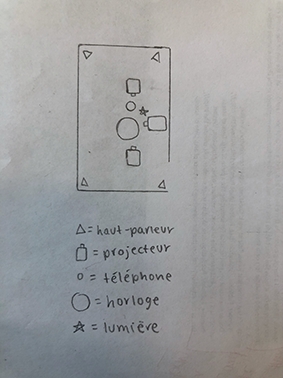

# L'Horloge de l'Apocalypse

>## *Maxime Sabourin, Louis-Philippe Gravel, Maxime De Falco, Tristan Girard-Montpetit, Alexis Lacasse*

### Projet Finissant TIM Montmorency | 2022

#### DATE DE LA VISITE : 24/03/2022

## À PROPOS DE L'EXPOSITION DES PROJETS FINISSANTS - Moebius
>#### Ce texte est tiré du Moebius des finissants TIM Montmorency 2022 pour nous mettre dans l'ambiance de leur exposition.

Mémoires d'un futur fragile, fragments du passé oublié. Histoire égarée, puis retrouvée. Imaginer le présent, réinventer l'avenir. Le temps s'écoule, se glisse, se répète et nous confronte toutes et tous. C'est une ligne, un cycle, une boucle sans fin, un ruban de Moebius au sein duquel l'humain a la volonté d'agir. On croit ne posséder aucun contrôle sur l'avancement du temps. Toutefois, l'histoire n'est-elle pas écrite par nos propres mains?

## DESCRIPTION - L'Horloge de l'Apocalypse
>#### Ces textes et photos sont tirés du site web des projets des finissants TIM 2022 - [L'horloge de l'apocalypse](https://tim-montmorency.com/2022/projets/L-horloge-de-l-apocalypse/docs/web/index.html)
L’horloge de l’apocalypse représente la ligne du temps de l’humanité. Selon le concept de l’horloge, il est présentement 11 h 58 et il reste 2 minutes avant la fin de l’humanité. À travers ce projet, l’interacteur est invité à contrôler l’horloge grâce aux aiguilles et ainsi manipuler la ligne du temps. Au cours de l’expérience, vous pourrez vivre les différentes époques auxquelles la terre a été exposée. Vous serez exposé aux différents enjeux actuels à travers la projection qui vous entourera et par le fait même vous plongera dans une immersion totale.

## EXPLICATION SUR LA MISE EN ESPACE DE L'OEUVRE
- L'oeuvre est dans le petit studio, isolé de toutes les autres oeuvres.
- Les animations sont projetées sur des rideaux blancs et prennent tous les murs de la pièce, sauf celui qui est derrière nous. 

- L'horloge tient par un trépied, puis le téléphone est sur un piédestal juste à côté de celle-ci. 

- La pièce est insonorisée, donc le son des 4 haut-parleurs accrochés au plafond, dans chaque coin de la pièce, nous donnait l'impression de littéralement faire partie de l'animation.  
- Il y a seulement une seule lumière, placée juste à côté du projecteur qui projète l'animation d'en face, qui illumine l'endroit où on doit se tenir pour faire démarrer l'animation. 

                                                                               

## Voici le croquis de l'oeuvre L'Horloge de l'Apocalypse

## Liste des composantes de l'oeuvre ou du dispositif 
>#### Ces textes sont tirés du site web des projets des finissants TIM 2022 - [L'horloge de l'apocalypse](https://tim-montmorency.com/2022/projets/L-horloge-de-l-apocalypse/docs/web/index.html)

- 11 animations conçues avec after effects (1 par scène)
- 1 animation supplémentaire conçue avec after effects pour la scène finale
- Effets sonores divers pour la scène d'introduction et la scène finale
- 11 trames sonores (1 par scène), le tout est évolutif
- 4 modules multimédias (captation des données, interprétation des données, contrôle d'éclairage, contrôle vidéo)

## Liste des éléments nécessaires pour la mise en exposition 
>#### Ces textes sont tirés du site web des projets des finissants TIM 2022 - [L'horloge de l'apocalypse](https://tim-montmorency.com/2022/projets/L-horloge-de-l-apocalypse/docs/web/index.html)

- Audio
  - 4 haut-parleurs
  - 8 fils XLR 3
  - Focusrite carte de son

- Vidéo
  - 3 projecteurs vidéo lentille ultra wide 0.3
  - 3 systèmes d'accrochage
  - 1 caméra Sony a6500

- Lumière
  - un projecteur de lumière couleur
  - 2 fils XLR 3 conducteurs de 20'
  - Console DMX
  - Interface DMX USB
 
- Électricité
  - 8 cordons IEC (pour l'alimentation des haut-parleurs)
  - 2 extensions 3 fiches et 3 conducteurs
  - 2 multiprises

- Réseau
  - 5 fils ethernet

- Ordinateur
  - 1 ordinateur de l'école ou 2 si le premier ne suffit pas
  - 2 micro-contrôleurs (Arduino)

- Autre
  - Kit de caméra
  - Kit de détection de présence (capteur de mouvement (kinect) pour le spotlight)
  - 1 potentiomètre
  - Toile blanche (pour projection)
  - 1 bouton
  - 8 safety

## EXPÉRIENCE VÉCUE:

- DESCRIPTION DE VOTRE EXPÉRIENCE DE L'OEUVRE: 
  - Directement quand je suis rentrée dans la pièce je me suis senti dans une autre dimension où il faisait sombre et tout était mystérieux.
  - Je pouvais entendre les différentes bandes sonores tout autour de moi de la façon dont les haut-parleurs étaient placés et ça a fait en sorte de nous transporter de monde en monde comme si je faisais partie de l'animation et ce, dans chaque univers présenté.
  - Plus l'heure avançait, plus j'étais impressionée et je pouvais ressentir toute la passion et l'effort mit dans ce travail.
  - Le fait que les univers changent à chaque heure et que ceux-ci deviennent de plus en plus "stressants" accompagné la bande sonore m'a rendu plus tendue et stressée à chaque fois que je voulais tourner l'aiguille. C'est exactement ce que je voulais ressentir en allant voir l'exposition et j'ai été royalement servie. 
  

- CE QUE J'AI LE PLUS AIMÉ:
  - Le fait que l'oeuvre soit mis à part des autres fait vraiment une grande différence surtout au niveau sonore. Le tempo du son était super bien fait et j'avais l'impression de ne plus être à l'école. C'est comme si je rentrais dans un petit cinéma et qu'il fallait activer quelque chose pour regarder le film. J'ai aimé ça parce que j'ai pu expérimenter l'expérience à fond et ressentir des émotions à chaque fois que quelque chose de différent se passait et je ne voulais pas que ça arrête, je voulais en voir plus!

- ASPECT QUE J'AI MOINS AIMÉ: 
  - Lorsque l'aiguille atteint l'apocalypse, j'aurais aimé que l'animation soit vraiment plus apocalyptique et qui ressemblerait plus à un univers de l'enfer, de lave et de feu. J'ai moins aimé le fait que la fin du monde soit représentée par une représentation d'une guerre mondial. Je comprends qu'ils essayaient d'aller dans le plus réaliste et donc, une vraie fin du monde à cause de la guerre, mais dans ma tête, lorsque je pense à fin du monde c'est vraiment que tout est détruit, du feu, etc...

## MON ORDRE DE PRÉFÉRENCE APRÈS LA VISITE

1. L'Horloge de l'Apocalypse
   - Avant de faire la visite, nous avions à remplir à quoi on s'attendait lors de l'exposition «J'aime le principe de l'Horloge de l'Apocalypse qui représente toutes les facettes de notre société. Le fait qu'une horloge représente littéralement «l'histoire» de la Terre et chacune de ses «phases», la création nous porte à réfléchir sur l'avenir et sur ce qu'on pourrait faire pour éviter le futur que représente l'animation lorsque l'aiguille de l'horloge est sur le 12 (donc l'apocalypse/la fin du monde). J'imagine que chaque interacteur va être fasciné et réagir de façon positivement par le mécanisme de l'horloge qui est relié aux animations.» J'ai vraiment été servi dans ce que je m'attendais. J'ai ressenti une panoplie d'émotion, comme prévu et attendu. En fait, l'exposition de cette oeuvre a encore mieux été que ce dont je m'attendais. Chaque facette de la société était bien représentée et avait de belles animations qui nous faisaient vivre multiples émotions.  
   
2. Chère Sasha
   - Avant de faire la visite, je me posais beaucoup de questions à savoir comment allait être disposés les objets.  Selon l'explication du projet, je ne croyais pas possible que tous les critères démontrés puissent faire partie d'un seul et même projet et que ça réussisse aussi bien. Lorsque je suis allée voir l'exposition, j'ai été agréablement surprise par la mise en place, à quel point c'était beau et spectaculaire. Les personnes ayant travaillé sur ce projet se sont donnés beaucoup de peine pour donner un aussi bon résultat. J'ai trouvé impressionnant tous les objets interactifs qu'il y avait, ceux-ci nous ont vraiment aidés à nous mettre dans la peau de Sasha et de mieux comprendre l'histoire de sa vie, ce qui nous a sensibilisé sur ce sujet. J'ai aussi vraiment aimé le fait qu'à la fin de l'expérience, on pouvait laisser un petit message positif pour Sasha. Cela terminait l'exposition en beauté et cela m'a comblé de bonheur par le simple fait de lui laisser un petit mot réconfortant. Ils ont bien réussi à nous donner des frissons et des émotions et ce, dès nos premiers pas dans la chambre.
   
3. Chronaufrage
   - J'ai beaucoup aimé les illustrations et les émotions que ceux-ci nous donnaient. Premièrement, en regardant le tout, je me sentais comme dans un conte de fée, l'ambiance était calme et paisible, mais à la fois angoissante. J'avais des frissons par le simple fait que par nos mouvements, la fillette  devenait de plus en plus stressée, ce qui, par le fait même, nous rendait stressé en retour. Chaque détail de la création était bien pensé et pour ma part, je ne voulais pas quitter mes yeux du projet, puisqu'il y avait tout le temps des choses différentes à contempler, et chacun de ces effets nous faisaient ressentir des émotions différentes.
   
4. Jeu temporel
   - J'ai un peu moins aimé cette création.  Malgré qu'elle était assez sympathique, je pense que je m'étais fait trop d'attentes. J'ai trouvé qu'il manquait d'ambiance sonore et que lorsque l'animateur devenait soi-disant plus «sombre», je n'ai pas ressenti l'émotion de surprise et le stresse de devoir avoir une bonne réponse. J'aurais vraiment apprécié que les créateurs exagèrent l'ambiance de «terreur» pour vraiment être étonnée et submergée dans le jeu. J'ai aimé les effets glitch par contre, c'était bien fait!
   
5. 3 minutes
   - J'ai trouvé que c'était quand même bien fait honnêtement, je pensais au début que ça allait être ordinaire, mais au contraire, c'était au-delà de mes attentes. Ils ont bien réussi leur but de faire en sorte que les 3 minutes dans le caisier passe plus lentement que les 3 minutes dans le gymnase. Je me suis sentis seule dans le casier et lorsque j'ai enlevé le casque et qu'il y avait des faits sur l'intimidation, je me suis sentis vraiment «fragile» et je n'en revenais pas à quel point une expérience, dans le corps d'une personne vivant une situation similaire, pouvait être aussi choquante.
   
6. Distorsion collective
   - L'oeuvre était sympathique, mais je me suis fait un peu trop d'attentes, je n'ai pas eu totalement les émotions renssenties que je croyais ressentir. J'ai trouvé le concept un tantinet répétitif, encore un sujet sur la Covid! Malgré cela, c'était bien. Je pense que j'aurais mis davantage l'emphase pour que le tout soit plus anxiogène et angoissant.
