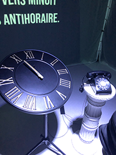
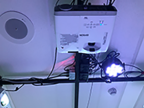

# L'Horloge de l'Apocalypse

>## *Maxime Sabourin, Louis-Philippe Gravel, Maxime De Falco, Tristan Girard-Montpetit, Alexis Lacasse*

### Projet Finissant TIM Montmorency | 2022

#### DATE DE LA VISITE : 24/03/2022

## À PROPOS DE L'EXPOSITION DES PROJETS FINISSANTS - Moebius
>#### Ce texte est tiré du Moebius des finissants TIM Montmorency 2022 pour nous mettre dans l'ambiance de leur exposition

Mémoires d'un futur fragile, fragments du passé oublié. Histoire égarée, puis retrouvée. Imaginer le présent, réinventer l'avenir. Le temps s'écoule, se glisse, se répète et nous confronte toutes et tous. C'est une ligne, un cycle, une boucle sans fin, un ruban de Moebius au sein duquel l'humain a la volonté d'agir. On croit ne posséder aucun contrôle sur l'avancement du temps. Toutefois, l'histoire n'est-elle pas écrite par nos propres mains?

## DESCRIPTION - L'Horloge de l'Apocalypse
>#### Ces textes et photos sont tirés du site web des projets des finissants TIM 2022 - [L'horloge de l'apocalypse](https://tim-montmorency.com/2022/projets/L-horloge-de-l-apocalypse/docs/web/index.html)
L’horloge de l’apocalypse représente la ligne du temps de l’humanité. Selon le concept de l’horloge, il est présentement 11 h 58 et il reste 2 minutes avant la fin de l’humanité. À travers ce projet, l’interacteur est invité à contrôler l’horloge grâce aux aiguilles et ainsi manipuler la ligne du temps. Au cours de l’expérience, vous pourrez vivre les différentes époques auxquelles la terre a été exposée. Vous serez exposé aux différents enjeux actuels à travers la projection qui vous entourera et par le fait même vous plongera dans une immersion totale.

## EXPLICATION SUR LA MISE EN ESPACE DE L'OEUVRE
- L'oeuvre est dans le petit studio, isolé de toutes les autres oeuvres.
- Les animations sont projetés sur des rideaux blanc et prennes toutes les murs de la pièce, sauf celui qui est dèrrière nous. 

- L'horloge tient par un trépied, puis le téléphone est sur un piédestal juste à côté de celle-ci. 

- La pièce est insonorisé, donc le son des 4 haut-parleur accroché au plafond, dans chaque coin de la pièce, nous donnais l'impression de littéralemnt faire partie de l'animation.  
- Il y a seulement une seule lumière, placé juste à côté du projecteur qui projète l'animation d'en face, qui illumine l'endroit où on doit se tenir pour faire démarer l'animation. 

                                                 

## Voici le croquis de l'oeuvre L'Horloge de l'Apocalypse

## Liste des composantes de l'oeuvre ou du dispositif 
>#### Ces textes sont tirés du site web des projets des finissants TIM 2022 - [L'horloge de l'apocalypse](https://tim-montmorency.com/2022/projets/L-horloge-de-l-apocalypse/docs/web/index.html)

- 11 animations conçues avec after effects (1 par scène)
- 1 animations supplémentaires conçues avec after effects pour la scène finale
- Effets sonores divers pour la scène d'introduction et la scène finale
- 11 trames sonores (1 par scène), le tout est évolutif
- 4 modules multimédia (captation des données, interprétation des données, contrôle d'éclairage, contrôle vidéo)

## Liste des éléments nécessaires pour la mise en exposition 
>#### Ces textes sont tirés du site web des projets des finissants TIM 2022 - [L'horloge de l'apocalypse](https://tim-montmorency.com/2022/projets/L-horloge-de-l-apocalypse/docs/web/index.html)

- Audio
  - 4 haut-parleurs
  - 8 fils XLR 3
  - Focusrite carte de son

- Vidéo
  - 3 projecteurs vidéo lentille ultra wide 0.3
  - 3 système d'acrochage
  - 1 caméra Sony a6500

- Lumière
  - un projecteur de lumière couleur
  - 2 fils XLR 3 conducteurs de 20'
  - Console DMX
  - Interface DMX USB
 
- Électricité
  - 8 cordons IEC (pour l'alimentation des haut-parleurs)
  - 2 extensions 3 fiches et 3 conducteurs
  - 2 multiprise

- Réseau
  - 5 fils ethernet

- Ordinateur
  - 1 ordinateur de l'école ou 2 si le premier ne suffit pas
  - 2 micro-contrôleur (Arduino)

- Autre
  - Kit de camera
  - Kit de detection de présence (capteur de mouvement (kinect) pour le spotlight)
  - 1 potentiomètre
  - Toile blanche (pour projection)
  - 1 bouton
  - 8 safety

## EXPÉRIENCE VÉCUE:

- DESCRIPTION DE VOTRE EXPÉRIENCE DE L'OEUVRE: 
  - Directement quand je suis rentrée dans la pièce je me suis senti dans une autre dimention où il faisait sombre et tout était mystérieux.
  - Je pouvais entendre les différentes bandes-sonore tout autour de moi de la façon dont les haut-parleurs étaient placés et ça a fait en sorte de nous transporter de monde en monde comme si tu faisait partie de l'animation, dans chaque univers présenté.
  - Plus l'heure avancait, plus j'étais impressionée et je pouvais ressentir tout la passion et l'effort mit dans ce travail.
  - Le fait que les univers changeant devenant de plus en plus stressant, avec leur bande-sonore, m'a rendu plus tendue et stressée à chaque fois que je voulais tourner l'aiguille. C'est exactement ce que je voulais ressentir en ayant voir l'exposition et j'ai été royalement servie. 
  

- CE QUE J'AI LE PLUS AIMÉE:
  - Le fait que l'oeuvre soit mis-à-part des autres fait vraiment une grande différence surtout niveau sonore. Le tempo du son était super bien fait et j'avais l'impression de ne plus être à l'école. C'est comme si je rentrais dans un petit cinéma et qu'il fallait activé quelque chose pour regarder le film. J'ai aimé ça parce que j'ai pu expérimenté l'expérience à fond et ressentir des émotions à chaque fois que quelque chose de différent ce passait et je ne voulais pas que ça arrête, je voulais en voir plus!

- ASPECT QUE J'AI MOINS AIMÉE: 
  - Lorsque l'aiguille atteint l'apocalypse, j'aurais aimé que l'animation soit vraiment plus apocalyptique et qui ressemblerait plus à un univers de l'enfer, de lave et de feu. J'ai moins aimé le fait que la fin du monde soit représenter par une représentation d'une guerre mondial. Je comprend qu'ils essayaient d'aller dans le plus réalistique et donc, une vraie possible fin du monde à cause de la guerre, mais dans ma tête lorsque je pense à fin du monde c'est vraiment tout est détruit, du feux, etc...

## MON ORDRE DE PRÉFÉRENCE APRÈS LA VISITE

1. L'Horloge de l'Apocalypse
   - Avant de faire la visite, nous avions à remplir à quoi on s'attendait lors de l'exposition, puis j'ai vraiment été servis dans ce que je m'attendais. J'ai ressentie plein d'émotions, comme prévu et attendu. En fait, l'exposition de cet oeuvre est encore mieux que ce que je m'attendais
2. Chère Sasha

3. Chronaufrage

4. Jeu temporel

5. 3 minutes

6. Distorsion collective
